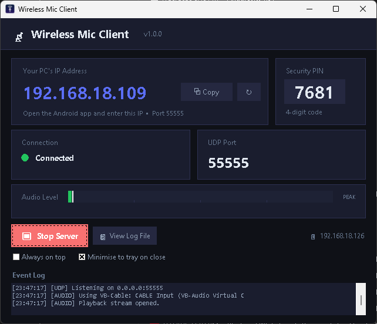
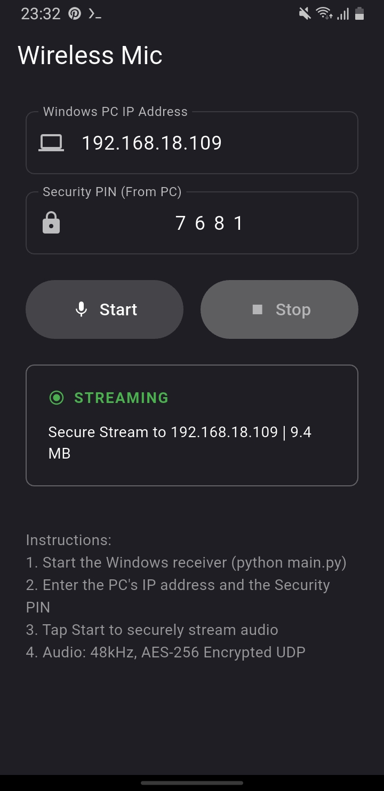

# 📡 Wireless Microphone System

A high-performance, low-latency wireless microphone system that streams encrypted audio from an Android device to a Windows PC over Wi-Fi using UDP.

---

## 🏗️ Architecture

```
Android (Mic) → AudioRecord (Kotlin) → AES-256 Encryption → UDP (Port 55555)
    ↓ (Wi-Fi)
Windows (GUI Client) → AES-256 Decryption → PyAudio → VB-Cable (Virtual Microphone)
```

- **Audio Specs**: 48,000 Hz, 16-bit PCM, Mono, Uncompressed
- **Security**: AES-256-CBC Payload Encryption with dynamic per-packet IVs & 4-digit PIN authentication
- **Transport**: UDP over Wi-Fi, port 55555 with 2-second heartbeat monitoring
- **Chunk Size**: 4800 bytes per packet (~100ms audio frame)

---

## ✨ Features

### 📱 Android App (Sender)
- **High-Priority Audio Capture**: Native Kotlin `AudioRecord` engine running on a dedicated thread (`MAX_PRIORITY`).
- **End-to-End Security**: AES-256-CBC encryption using a user-configurable 4-digit PIN.
- **Background & Screen-Off Streaming**: Integrated Foreground Task with CPU `PARTIAL_WAKE_LOCK` and high-performance Wi-Fi lock.
- **Smart Preferences**: Automatically saves and restores the last connected IP address and PIN.
- **Live Stats**: Real-time transmission metrics (packet count and MBs transferred).

### 💻 Windows Client (Receiver)
- **Modern Dark-Themed GUI**: Built with Tkinter featuring live audio level meters and peak indicators.
- **4-Digit PIN Authentication**: Automatically generates and displays a security PIN to pair with the Android app.
- **VB-Audio Virtual Cable Support**: Routes incoming microphone audio to Discord, OBS, Zoom, Teams, or any Windows app.
- **Auto VB-Cable Helper**: Automatically detects missing VB-Cable drivers and prompts seamless installation.
- **System Tray Integration**: Runs silently in the background tray with status notifications.
- **Live IP Detection**: Monitors local network interfaces and auto-refreshes the IPv4 address.

---

## 📸 Application Screenshots

| Windows Desktop Client (Receiver) | Android Mobile App (Sender) |
| :---: | :---: |
|  |  |

---

## ⚙️ Prerequisites

### Android Requirements
- Android 10+ (API 29+) device connected to the same Wi-Fi network as the Windows PC
- Flutter SDK `3.10+` (if building from source)

### Windows Requirements
- Windows 10 / 11 (64-bit)
- Python `3.10+` (if running from source)
- [VB-Audio Virtual Cable](https://vb-audio.com/Cable/) (or allow the client to auto-install it)

---

## 🚀 Quick Start Guide

### 1. Windows Client Setup

#### Option A: Running from Installer (Recommended)
1. Download and run `WirelessMic_Setup.exe` from the latest GitHub Release.
2. Launch **Wireless Mic Client** from your Start Menu or Desktop shortcut.

#### Option B: Running from Source
```powershell
cd windows_client
pip install -r requirements.txt
python src/main.py
```

> **Note on Audio Routing (VB-Cable):**
> 1. Launch **Wireless Mic Client** on Windows and note your **IP Address** and **4-Digit PIN**.
> 2. Open Sound Settings on Windows → set **CABLE Input (VB-Audio)** as default playback device, or select **CABLE Output (VB-Audio)** as your microphone in Discord / OBS / Zoom.

---

### 2. Android App Setup

#### Option A: Installing APK
1. Download `app-release.apk` from the latest GitHub Release.
2. Install it on your Android device.

#### Option B: Building from Source
```powershell
cd android_app
flutter pub get
flutter build apk --release
```

#### Connecting the App:
1. Open the **Wireless Mic** app on Android.
2. Grant microphone and notification permissions when prompted.
3. Enter your Windows PC's **IP Address** and the **4-Digit PIN** shown on the Windows client GUI.
4. Tap **Start** to begin streaming live audio.

---

## 🔍 Finding Your Windows IP Manually

If you need to verify your IP address manually, open PowerShell on Windows and run:
```powershell
ipconfig | findstr /i "IPv4"
```
Look for your active Wi-Fi adapter IPv4 address (e.g., `192.168.x.x`).

---

## 🛠️ Troubleshooting

| Issue | Cause | Solution |
|---|---|---|
| **Error: Incorrect PIN** | PIN mismatch between apps | Match the 4-digit PIN on Android with the code shown on the Windows GUI |
| **No audio in Discord/OBS** | Input device not set | Select **CABLE Output (VB-Audio)** as your microphone input device in your target app |
| **Connection Failed** | Windows Firewall blocking port 55555 | Allow `WirelessMic.exe` or port `55555 UDP` through Windows Defender Firewall |
| **Choppy Audio / High Latency** | Wi-Fi interference or 2.4GHz band | Connect both PC and phone to a 5GHz Wi-Fi network for optimal latency |
| **Stream stops on screen lock** | Battery optimization killing app | Ensure background activity permissions are allowed for Wireless Mic on Android |

---

## 📜 License & Acknowledgments

- **License**: MIT License
- **VB-Audio Cable**: Uses VB-Audio Virtual Cable (https://vb-audio.com/Cable/) for audio routing on Windows.
