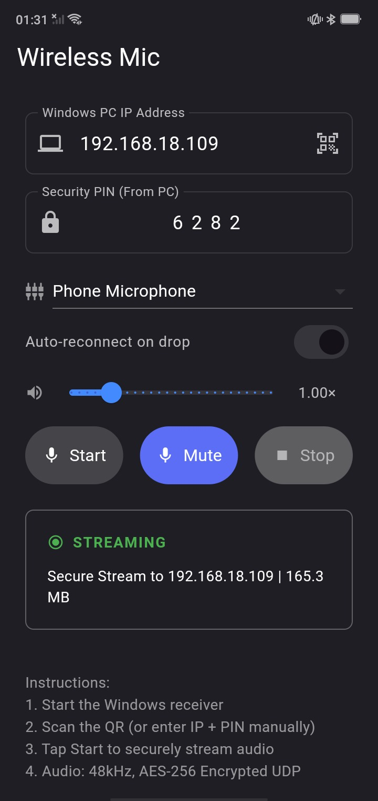

# 📡 Wireless Microphone System

A high-performance, low-latency wireless microphone system that streams **encrypted audio** from an Android device to a Windows PC over Wi-Fi using UDP — and routes it into OBS, Discord, Zoom, or any app via a virtual microphone.

---

## 🏗️ Architecture

```
Android (Mic) → AudioRecord (Kotlin) → AES-256 Encryption → UDP :55555
    ↓ (Wi-Fi)
Windows Client → AES-256 Decryption → DSP (gate/gain) → VB-Cable (Virtual Microphone)
```

- **Audio format**: 48,000 Hz, 16-bit PCM, mono
- **Security**: AES-256-CBC payload encryption with per-packet random IVs + 4-digit PIN pairing
- **Transport**: UDP over Wi-Fi, port `55555`, 2-second heartbeats, 3s watchdog
- **Packet format v2**: `[WM][ver][seq][timestamp][IV][ciphertext]` → enables live loss/jitter stats
- **Chunk size**: 4,800 bytes per packet (~100 ms of audio)

---

## ✨ Features

### 📱 Android App (Sender)
- **High-priority capture**: native Kotlin `AudioRecord` engine on a MAX_PRIORITY thread
- **End-to-end encryption**: AES-256-CBC keyed from the 4-digit PIN
- **QR pairing**: scan the code shown on the Windows client — IP + PIN filled automatically
- **Background & screen-off streaming**: foreground service + CPU wake lock + high-performance Wi-Fi lock
- **Auto-reconnect**: recreates the socket and keeps streaming through network drops
- **Microphone source**: Phone Mic or Bluetooth Headset (SCO routing)
- **Phone-side controls**: gain slider (0.5×–3×) + mute button
- **Remote control**: home-screen widget (Start/Stop) + Quick Settings tile
- **Smart preferences**: remembers last IP, PIN, gain, and toggles
- **Live stats**: packets sent and MB streamed

### 💻 Windows Client (Receiver)
- **Modern dark GUI**: Tkinter, live level meter with peak hold
- **Persistent PIN**: same PIN on every launch (no more retyping) + ↻ regenerate button
- **QR pairing**: built-in QR code (IP + PIN + port) for one-scan setup
- **Audio controls**: gain, noise gate (adjustable threshold + hold), mute, live monitor
- **Recording**: one-click WAV recording → `Music\WirelessMic` (auto-timestamped)
- **Multi-device**: multiple phones can stream simultaneously (mixed into the cable)
- **Live stats**: packets, loss %, jitter ms, MB, uptime, connected devices
- **Global hotkeys**: `Ctrl+Alt+M` mute • `Ctrl+Alt+R` record • `Ctrl+Alt+S` monitor
- **Auto-start with Windows**: optional, per-user (registry)
- **System tray**: runs in the background with notifications
- **VB-Cable helper**: detects missing VB-Cable drivers and offers one-click install
- **Live IP detection**: monitors network interfaces and auto-refreshes the IPv4 display

---

## 📸 Screenshots

| Windows Desktop Client (Receiver) | Android Mobile App (Sender) |
| :---: | :---: |
|  |  |

---

## ⚙️ Prerequisites

### Android
- Android 10+ (API 29+) on the same Wi-Fi network as the PC
- Flutter SDK `3.10+` (only if building from source)

### Windows
- Windows 10 / 11 (64-bit)
- Python `3.10+` (only if running from source)
- [VB-Audio Virtual Cable](https://vb-audio.com/Cable/) — the client auto-detects and offers to install it

---

## 🚀 Quick Start Guide

### 1. Windows Client

**Option A — Installer (recommended)**
1. Download [`WirelessMic_Setup-v2.0.exe`](https://github.com/satnam6g/flumo_mic/releases/latest) from the latest GitHub Release.
2. Launch **Wireless Mic Client** — it shows your IP, PIN, and a QR code.

**Option B — From source**
```powershell
cd windows_client
pip install -r requirements.txt
python src/main.py
```

### 2. Android App

**Option A — APK**
1. Download [`WirelessMic-Android-v2.0.apk`](https://github.com/satnam6g/flumo_mic/releases/latest) from the latest GitHub Release and install it.
2. Upgrading from v1.x? Uninstall the old app first (signing changed in v2.0).

**Option B — From source**
```powershell
cd android_app
flutter pub get
flutter build apk --release
```

### 3. Connect

1. Launch the Windows client — note the **IP**, **PIN**, or simply open **Show QR**.
2. In the Android app: tap the **QR icon** and scan, or type the IP + PIN manually.
3. Tap **Start** — the client turns green and the meter starts moving.

### 4. Use it anywhere

In OBS / Discord / Zoom / your browser, select **CABLE Output (VB-Audio Virtual Cable)** as the microphone input. (Never "CABLE Input" — that's the playback side.)

---

## ⌨️ Hotkeys (Windows)

| Keys | Action |
|---|---|
| `Ctrl+Alt+M` | Mute / unmute |
| `Ctrl+Alt+R` | Start / stop recording |
| `Ctrl+Alt+S` | Monitor on / off |

---

## 🔍 Finding Your Windows IP Manually

```powershell
ipconfig | findstr /i "IPv4"
```
Look for your active Wi-Fi adapter's IPv4 address (e.g. `192.168.x.x`).

---

## 🛠️ Troubleshooting

| Issue | Cause | Solution |
|---|---|---|
| **No audio in OBS/Discord** | Wrong input device | Select **CABLE Output (VB-Audio Virtual Cable)** as the microphone — not CABLE Input |
| **Connection Failed** | Firewall blocking UDP 55555 | Allow `WirelessMic.exe` (or port `55555 UDP`) through Windows Defender Firewall; network must be **Private** |
| **Error: Incorrect PIN** | PIN mismatch | The PIN is persistent now — check the client window and match it on the phone |
| **Phone shows "Sending" but PC says Waiting** | Old/wrong IP saved on the phone | Re-scan the QR or retype the current IP — UDP gives no delivery feedback |
| **Choppy audio / high latency** | Congested or 2.4 GHz Wi-Fi | Use a 5 GHz network; check loss/jitter in the client's stats bar |
| **Stream stops on screen lock** | Battery optimization | Allow background activity + disable battery optimization for Wireless Mic |
| **Two clients running** | Port conflict | Only one receiver can bind UDP 55555 — close the other instance |

---

## 📜 License & Acknowledgments

- **License**: MIT License
- **VB-Audio Cable**: uses [VB-Audio Virtual Cable](https://vb-audio.com/Cable/) for audio routing on Windows
